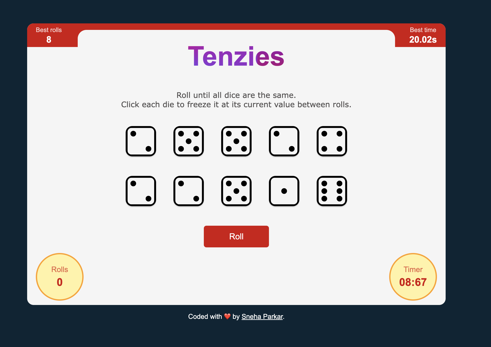

# Tenzies React Game (Scrimba React Course section 4 project)
This is a solution to the Tenzies Game project on Scrimba. 

It's a tenzis game that shows you 10 dice randomly with a value between 1 - 6 of course! Once you've selected the disered dice, you can display new ones by rolling the button. The game ends once you've selected the 10 dice that have the same value. It was fun building this mini-game using React 🤩

### Requirements

- useState, useEffect
- Use .map() and props
- Conditional Rendering
- Styled & polished

### Screenshot

### Getting Started with Create React App

This project was bootstrapped with [Create React App](https://github.com/facebook/create-react-app).

## Available Scripts

If you want to see the final product, in the project directory, you can run:

## `npm start`

Runs the app in the development mode.\
Open [http://localhost:3000](http://localhost:3000) to view it in your browser.

### Built with

- Semantic HTML5 markup
- CSS custom properties
- React.JS
- Flexbox

## Author

- Website - [sneha parkar](https://snehaparkar.in)
